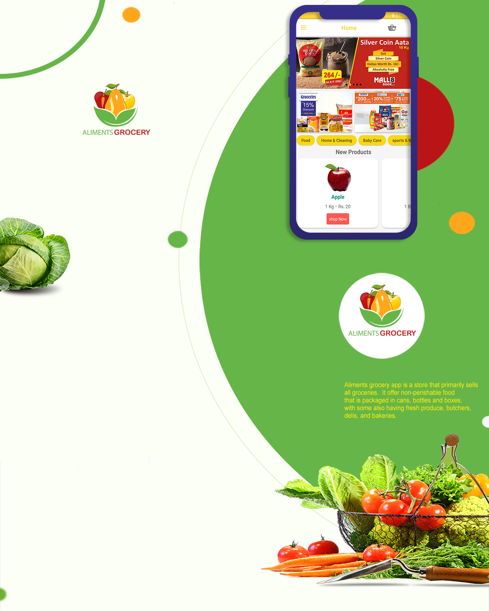
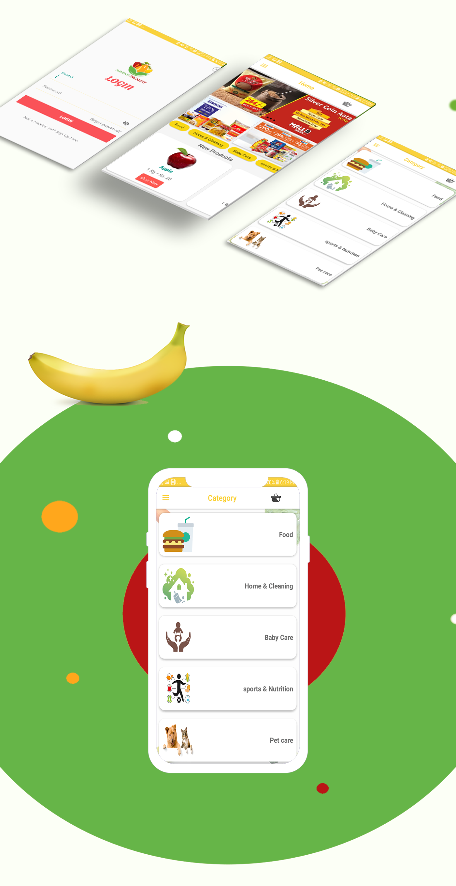
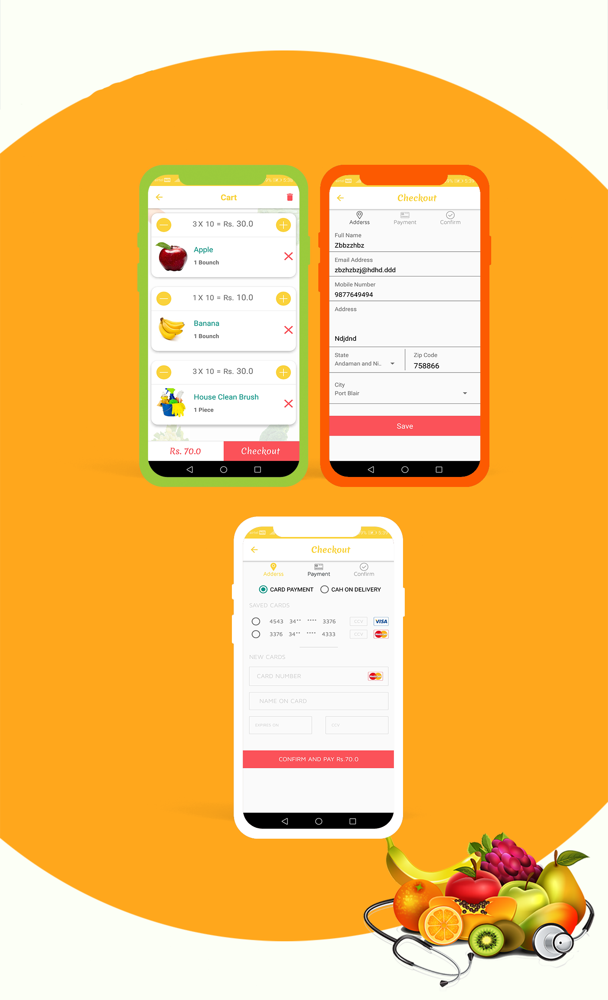
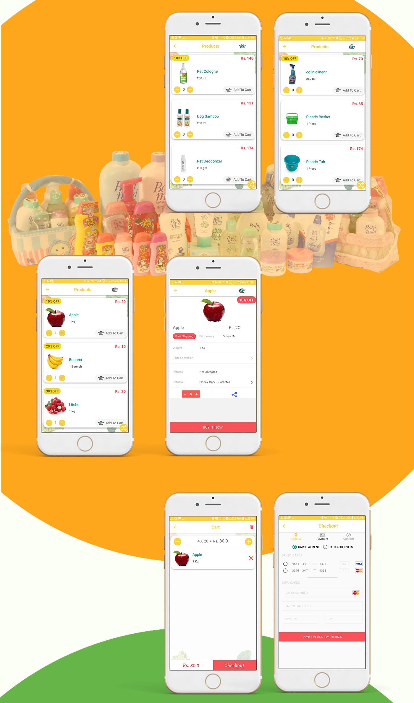
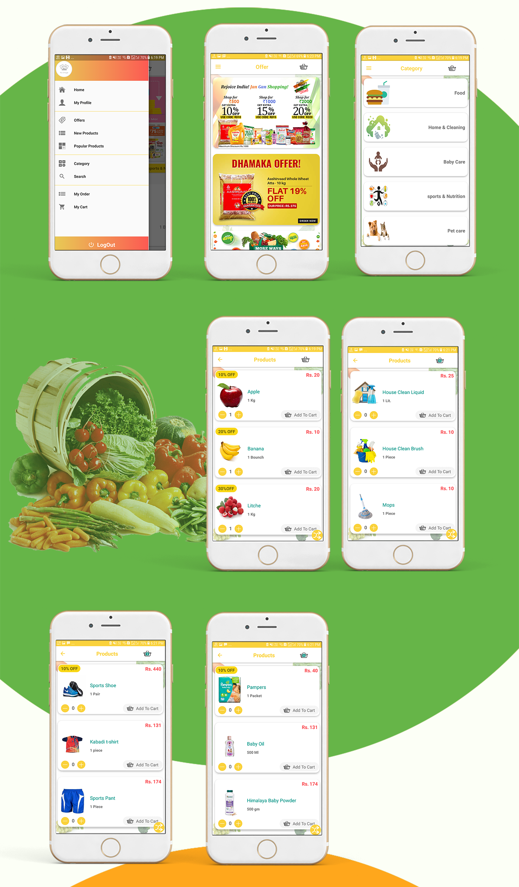
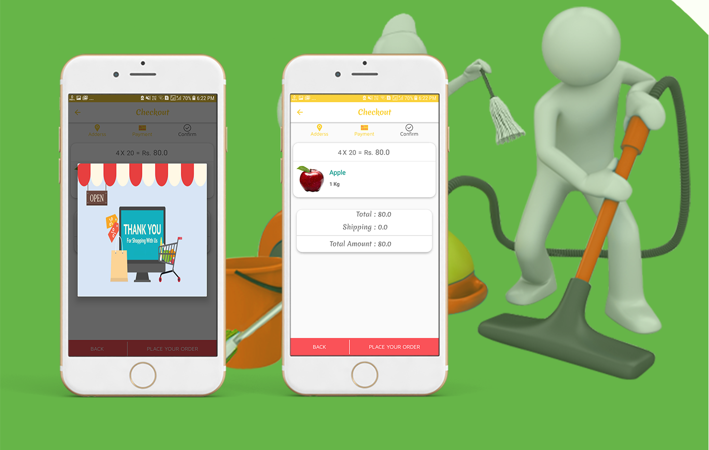
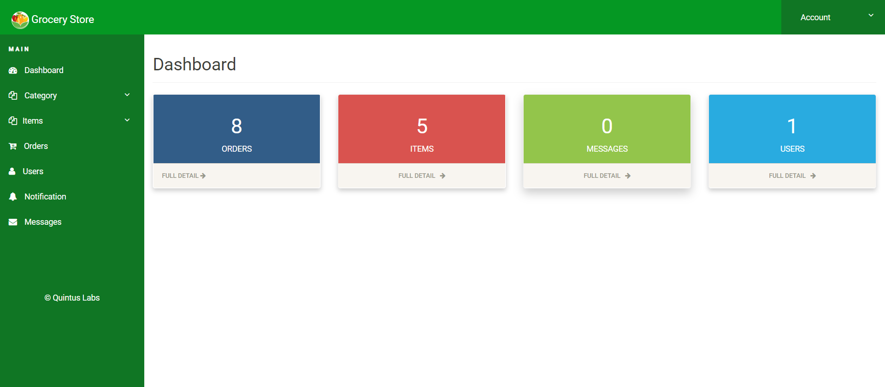
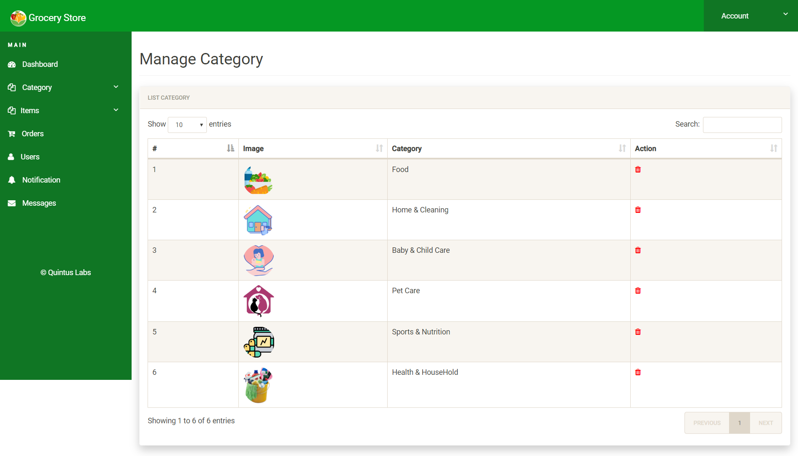
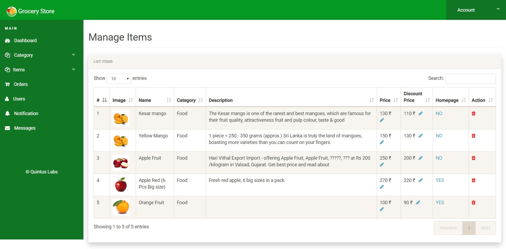

# Grocery Store
Grocery Store App, is an online shopping cart application. 
It comprises of 10+ screens with different features to make the navigate smooth & user-friendly.

**Features**

- Grocery App Android Template.
- Supported in all Devices.
- Change text, colours and graphics, add or modify photos.
- Customize every element as much, or as little as you want.
- fast searchable product.
- Customise elements (easy to edit).
- 100% free fonts.
- Perfect pixel (high quality design).
- Very clean and cool UI.
- Free updates.
- License.

* [GroceryStoreAndroid](https://u.pcloud.link/publink/show?code=XZxulmXZwEXImolNGnH0x0DxRuXzKJdtiGBk) - Grocery Store Android (Demo)

## Screen 

